# Homework 5: Road Generation

## Erin Goldberg
pennKey: engold

Link: https://engold.github.io/hw05-road-generation/

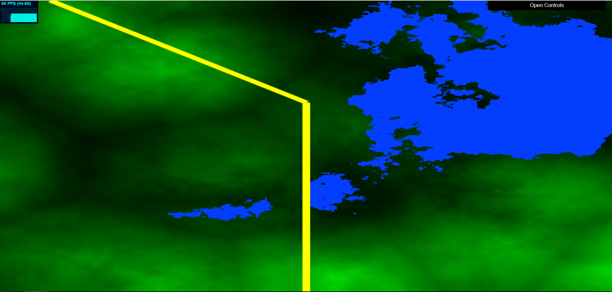

## References
- Class slides for noise
- FBM from //https://thebookofshaders.com/13/ and Adam's lecture Slides
- Mix function/lerp implementation https://www.khronos.org/registry/OpenGL-Refpages/gl4/html/mix.xhtml
- Intersection of two lines https://stackoverflow.com/questions/563198/how-do-you-detect-where-two-line-segments-intersect
- Writing to a texture buffer http://www.opengl-tutorial.org/intermediate-tutorials/tutorial-14-render-to-texture/
- LSystem Lecture Slides: https://cis700-procedural-graphics.github.io/files/lsystems_1_31_17.pd

## Requirements
- 2D Maps
  - Default view shows land and water map. Using FBM function, certain xy positions below a certain value are drawn as water.
 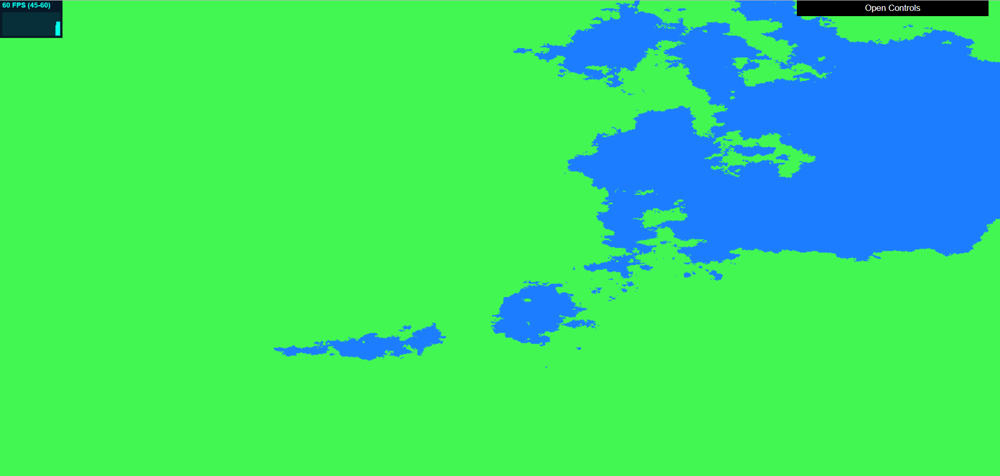

  - Terrain elevation map shows higher elevation in brighter green and lower elevation areas in darker green.
 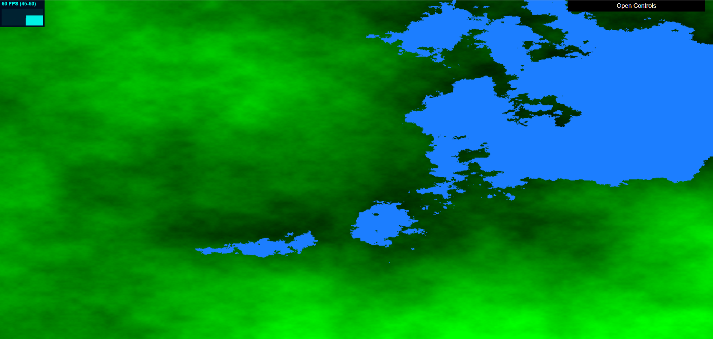

  - Population density map uses worley noise. Center of cells areas of denser population and are colored lighter than the rest of the cell.
 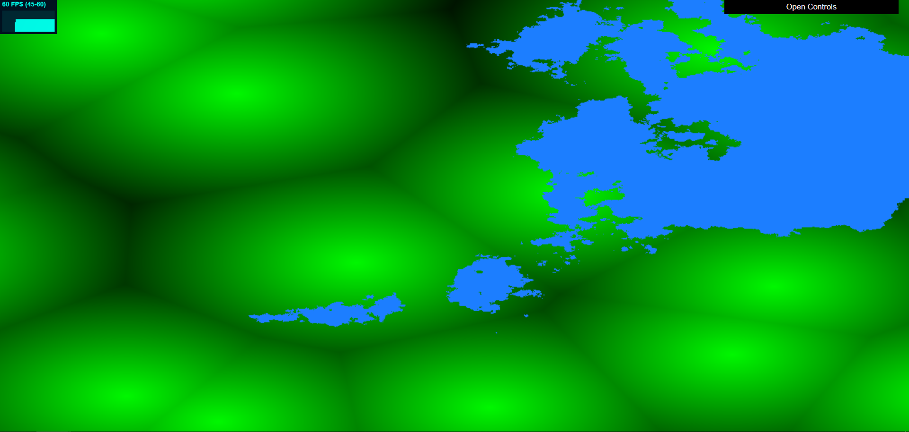

 - If you check box boxes in the GUI, you can see the Terrain Eleavation and the Population Density Maps overlayed.
  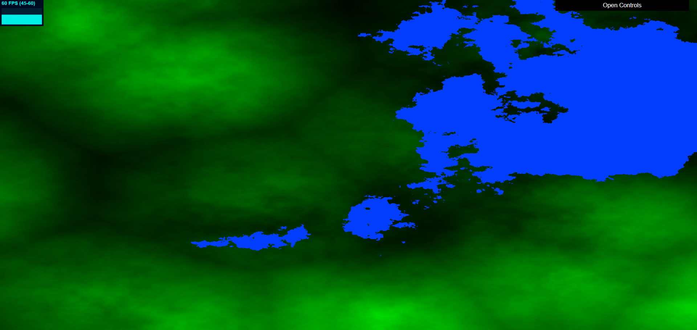

- Rendering noise data to a texture for use in constructing the LSystemHighway. Info, such as inWater, elevation, and population Density, were stored in rbg channels of the texture. (I think something with how I was setting up the texture or connecting the texture didn't entirely work because my highway has some issues...)
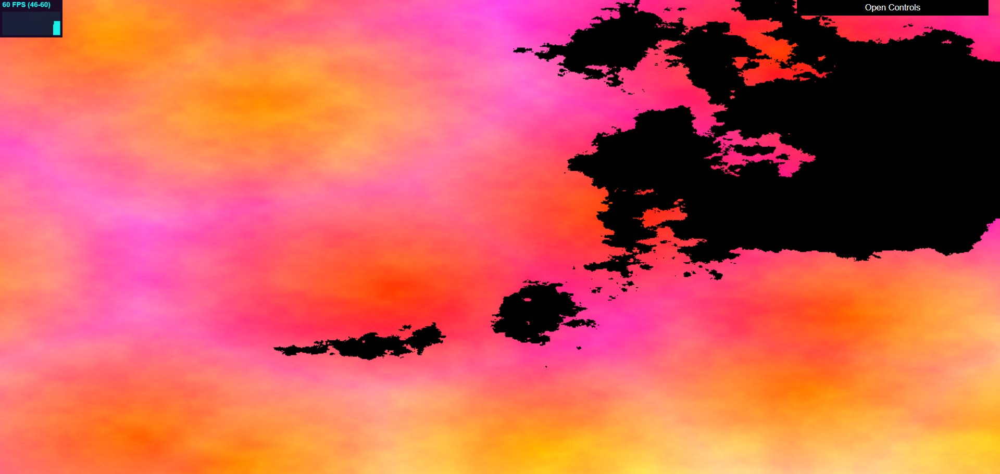

- Pseudo LSystem classes
  - LSystemHighway: the main class for the pseudo LSystem. It creates the LSystemHighway by intializing Highway Turtles and then expanding them to grow the Highway. (Not working perfectly, only getting a few lines to draw)
  - HTurtle: Highway Turtle class. This turtle has information about a Point, directional vectors, a quaternion for rotation, a targetPoint, and lists of Points and Edges. As the turtle is expanded, it tries to move forward and go towards areas that have denser populations. 
  - Edge: contains information about 2 points, a start and an end, as well as a boolean representing whether the edge is a highway road or a regular street road. That flag is used when setting the width/size of the edge to draw. Also contains a method for detecting line intersections and getting the overall transformation matricies used for instance rendering.
  - Point: contains informtation about the point's position, used to construct an Edge. Also includes a method for detecting proximity to other points.
  - Turtle (unused)- having issues with getting the city grid to draw, so ulitmatley the smaller draw turtle is not being used.
- Drawing/layout rules
  - Highyway favors areas of denser population (lighter green areas).
  - (Having trouble reading from my textureBuffer, something doesn't seem to be working...couldn't get city grids to draw)
  - Sparse layout of highways, drawn thicker than roads (ended up not drawing roads but the highways are still thickly drawn)
  - Highways can cross water

- Interactive GUI
  - Terrain Elevation
  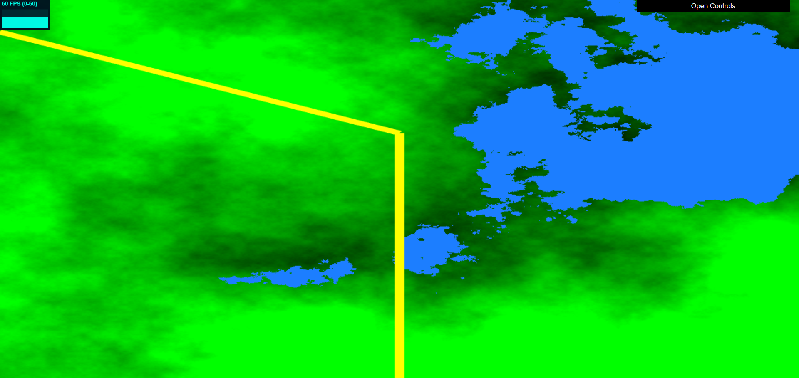
  - Population density
  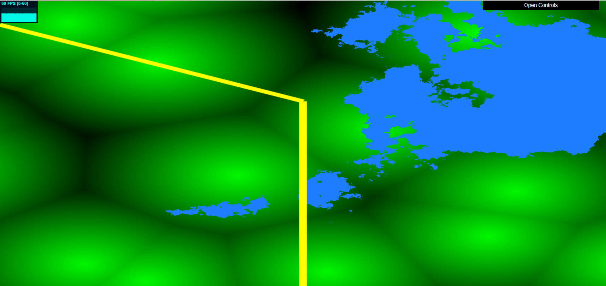
  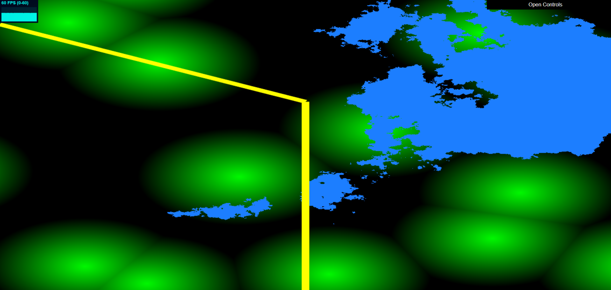
  - Highway Branch Angle
  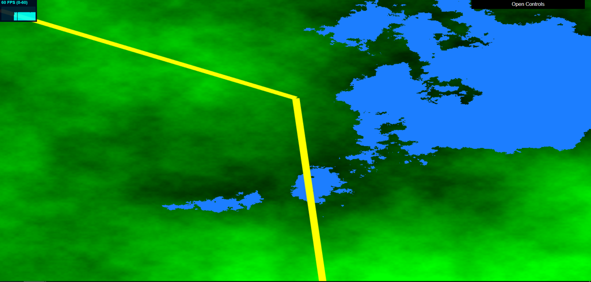
  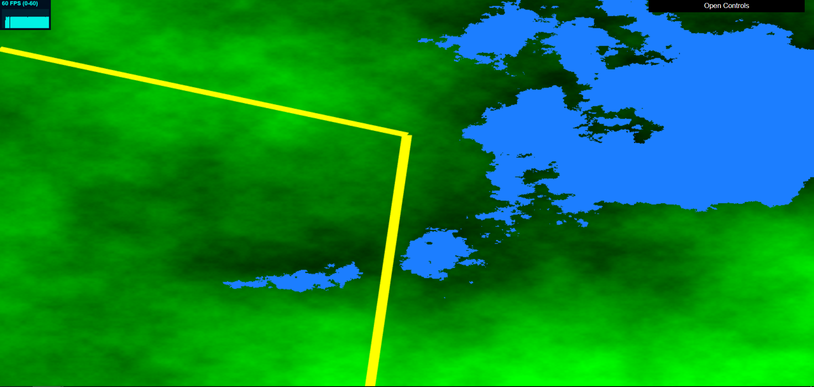

